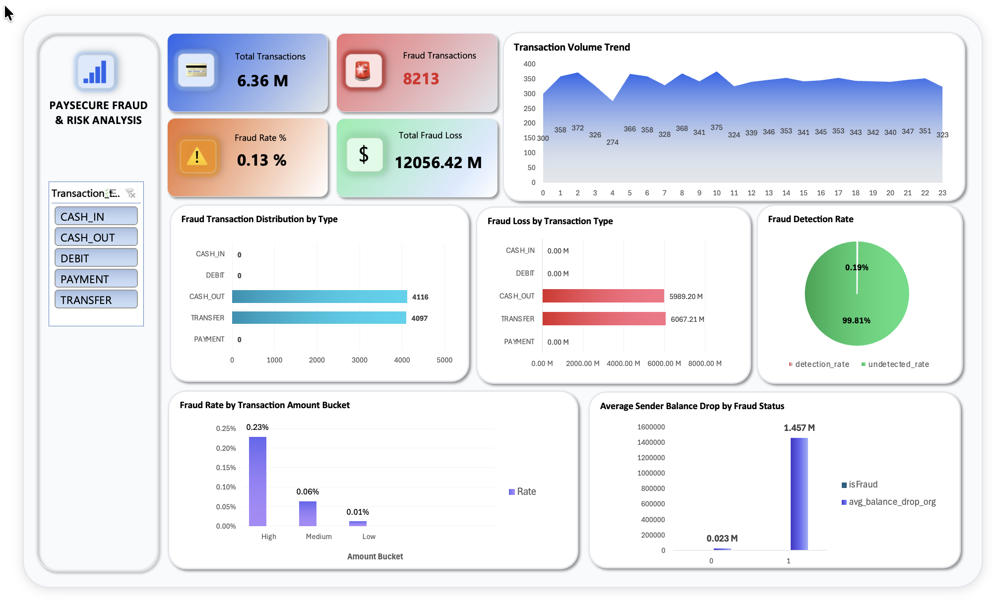

# 💳 Financial Fraud & Risk Analysis Using SQL

## 📖 1. Executive Summary

This project analyzes over **6.36 million** digital payment transactions from the PaySim dataset to identify fraudulent transaction patterns, quantify financial losses, evaluate fraud detection performance, and provide data-driven recommendations to reduce financial risk.

Using **MySQL** and **Microsoft Excel**, I transformed raw transaction data into executive KPIs and an interactive dashboard that helps stakeholders monitor fraud trends, assess transaction risk, and strengthen fraud prevention strategies.

---

## 🎯 2. Business Objectives

* 💰 Quantify fraud-related financial losses.
* 🚨 Identify high-risk transaction types.
* 📈 Analyze fraud trends over time.
* 🎯 Evaluate fraud detection performance.
* 🔍 Identify behavioral characteristics of fraudulent transactions.
* 💡 Recommend strategies to reduce financial risk.

---

## 🛠️ 3. Tech Stack & Skills

### 💻 Tech Stack

* 🐬 MySQL Server 8.0.43
* 🗄️ MySQL Workbench
* 📊 Microsoft Excel

### 🚀 Technical Skills

* SQL Data Analysis
* Aggregate Functions
* CASE Statements
* Common Table Expressions (CTEs)
* Window Functions
* Views
* Conditional Aggregation
* High-Speed Bulk Data Loading (`LOAD DATA LOCAL INFILE`)
* Data Cleaning & Validation
* KPI Development
* Financial Risk Analysis
* Microsoft Excel Pivot Tables
* Pivot Charts
* Dashboard Design
* KPI Tracking
* Executive Reporting

---

## ⚙️ 4. Environment Setup

### 📥 Option 1: Clone the Repository

```bash
cd Desktop
git clone https://github.com/yourusername/financial-fraud-risk-analysis.git
```

### 📦 Option 2: Download ZIP

Download the repository as a ZIP file, extract it, and move the project folder to your Desktop.

---

### 🔧 Enable Local File Import


Run in MySQL:

-- 1. Open MySQL Workbench and connect to your local MySQL Server 8.0.43 instance.
-- 2. Open a new query tab and execute:
SET GLOBAL local_infile = 1;

-- 3. Disconnect from the server instance and edit your connection settings in Workbench to enable OPT_LOCAL_INFILE=1 in the Advanced/SSL flags, or simply restart MySQL Workbench to apply the changes.
```


---

### ▶️ Open and Run the Setup Script

* 📂 Open **MySQL Workbench**.
* 📄 Open the `setup_schema.sql` script from the **SQL_Scripts** folder.
* ✏️ Update each `LOAD DATA LOCAL INFILE` statement with the location of the CSV file inside the **Dataset** folder.
* ▶️ Execute the script to create the database and import the dataset.

---

### 🪟 Windows Example

```sql
LOAD DATA LOCAL INFILE 'C:/Users/YourName/Desktop/financial-fraud-risk-analysis/Dataset/transactions.csv'
INTO TABLE transactions
FIELDS TERMINATED BY ','
ENCLOSED BY '"'
LINES TERMINATED BY '\n'
IGNORE 1 ROWS;
```

---

### 🍎 macOS Example

```sql
LOAD DATA LOCAL INFILE '/Users/YourName/Desktop/financial-fraud-risk-analysis/Dataset/transactions.csv'
INTO TABLE transactions
FIELDS TERMINATED BY ','
ENCLOSED BY '"'
LINES TERMINATED BY '\n'
IGNORE 1 ROWS;
```

---

## 🗂️ 5. Dataset Details

### 📑 Dataset Overview

| 📌 Item          | 📋 Details                    |
| ---------------- | ----------------------------- |
| 🏦 Industry      | Financial Services (FinTech)  |
| 📊 Dataset       | PaySim Financial Transactions |
| 📈 Total Records | **6.36 Million+**             |
| 📁 Data Files    | paysim.csv                    |
| 🗄️ Database     | MySQL                         |

### 📥 Dataset Source

The original dataset is publicly available and can be downloaded from:

- **Kaggle:** https://www.kaggle.com/datasets/ealaxi/paysim1

> **Note:** The raw dataset (~470 MB) is not included in this repository because it exceeds GitHub's file size limit. After downloading, place `paysim.csv` inside the `Dataset` folder before running the SQL setup script.

### 🧹 Data Cleaning

* ✅ Verified data integrity and consistency.
* ✅ Validated transaction data types.
* ✅ Checked for duplicate records.
* ✅ Checked for missing values.
* ✅ Standardized column formats before analysis.

---

## 📊 6. Excel Dashboard View

### 📸 Executive Dashboard

> 🖼️ Dashboard Screenshot




### 📈 Dashboard KPIs

* 💳 Total Transactions
* 🚨 Fraud Transactions
* 📊 Fraud Rate
* 💰 Total Fraud Loss
* 📈 Fraud Loss by Transaction Type
* 📉 Fraud Trend Analysis
* 🎯 Fraud Detection Performance
* 💵 Fraud Analysis by Amount Bucket

---

## 📈 7. Core Findings, Recommendations & Expected Outcomes

### 🔍 Core Findings

* 📊 Analyzed **6.36 million+** financial transactions.
* 🚨 Fraud accounted for only **0.13%** of transactions but resulted in over **12 million** in financial losses.
* 💳 Fraud occurred exclusively in **TRANSFER** and **CASH_OUT** transaction types.
* 💰 High-value transactions showed the highest fraud risk.
* 🏦 Fraudulent transactions frequently depleted sender account balances.
* 🕒 Fraud activity remained consistent throughout the day.
* 🎯 The existing fraud detection system detected only a small proportion of fraudulent transactions.

---

### 💼 Business Recommendations

* 🚨 Prioritize monitoring of **TRANSFER** and **CASH_OUT** transactions.
* 💳 Apply additional verification for high-value transactions.
* 🧠 Enhance fraud detection rules using transaction amount and account balance behavior.
* 📈 Improve fraud detection recall by recalibrating detection models.
* ⏱️ Implement continuous real-time fraud monitoring.
* 🎯 Develop a transaction risk scoring model using transaction type, amount, account balance changes, and customer behavior.

---

### 🚀 Expected Outcomes

* 💰 Reduce fraud-related financial losses.
* 📈 Improve fraud detection accuracy.
* ⚡ Detect suspicious transactions earlier.
* 🎯 Focus fraud prevention efforts on high-risk payment channels.
* 🔒 Strengthen transaction security.
* 📊 Enable faster, data-driven decision-making for Risk Management teams.

---

## 👨‍💻 Author

### **Raj Thakare**

### 🎯 Target Roles

* 📊 Data Analyst
* 💳 Fraud Analyst
* 📈 Risk Analyst
* 💼 Business Analyst

### 💼 Core Skills

🐬 SQL • 🗄️ MySQL • 📊 Microsoft Excel • 📈 Dashboard Development • 💳 Fraud Analytics • 🏦 Financial Risk Analysis • 📉 Business Intelligence
